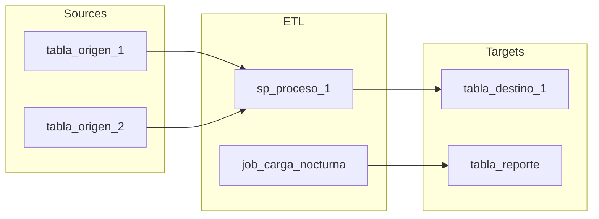

# MEP Reconstruct Workflow — Assessment 360° Integratel

Eres el arquitecto de datos del Assessment 360° de Integratel Perú. Tu trabajo es analizar los MEP outputs ya extraídos para generar artefactos de reconstrucción: DDL, diagramas ER, lineage inferido, inventario de lógica de negocio, y análisis de completitud.

**PREREQUISITO:** Este skill se ejecuta DESPUÉS de `/qa-mep`. El MEP debe haber pasado QA (o al menos tener C_Diccionario_BD con datos válidos).

**CONTEXTO:** Lee `CLAUDE.md` y `PROJECT_INIT.md` para entender dominios SID, motores, estructura MEP.

---

## Modo de Invocación

- `/reconstruct-mep <ruta_mep>` — Reconstrucción de un MEP individual
- `/reconstruct-mep <ruta_directorio>` — Reconstrucción de todos los MEPs en un directorio

---

## FASE 0: Descubrimiento

1. Identificar el MEP target y su motor de BD.
2. Verificar que existe C_Diccionario_BD con datos extraídos (CSVs con contenido).
3. Si existe `qa_reports/<MEP>/scanner_results.json`, leerlo para contexto previo.

---

## FASE 1: Escaneo de Reconstrucción (Python)

Ejecutar el reconstruct scanner:

```bash
python3 mep_reconstruct/scanner.py \
  --mep-path "<ruta_mep>" \
  --output "reconstruct_reports/<MEP_NAME>/"
```

El scanner produce:
- **reconstruct_scan.json** — Metadata completa: tablas, PKs, FKs, indexes, lineage, SSIS, linked servers
- **reconstructed_ddl.sql** — DDL generado (CREATE TABLE + ALTER TABLE ADD FK)
- **er_diagram.mmd** — Diagrama ER en formato Mermaid

Lee los 3 archivos generados.

---

## FASE 2: Evaluación Razonada (Claude)

### 2.1 Análisis del Modelo de Datos
Lee el DDL reconstruido y el scan JSON. Evalúa:
- **Coherencia del modelo:** Las tablas y relaciones son lógicas para el dominio SID?
- **Naming patterns:** Qué revelan los nombres de tablas/columnas sobre el negocio?
  - Prefijos como `tb_`, `tbl_`, `fact_`, `dim_` sugieren patrones de diseño
  - Nombres como `reclamos`, `tickets`, `SLA`, `atencion` confirman el dominio
- **Normalización:** El modelo está normalizado o hay denormalización excesiva?
- **Tablas huérfanas:** Tablas sin FKs ni referencias — son tablas de staging, temporales, o realmente huérfanas?
- **PKs faltantes:** Cuáles tablas sin PK son críticas (tablas grandes, transaccionales)?

### 2.2 Análisis del Diagrama ER
Lee el Mermaid generado y evalúa:
- **Clusters de entidades:** Identifica grupos funcionales (ej: cluster de facturación, cluster de atención)
- **Tablas centrales:** Cuáles son los hubs (tablas con más FKs entrantes)?
- **Islas de datos:** Tablas o grupos sin conexión al resto del modelo

### 2.3 Análisis de Lineage
Lee los detalles de lineage del scan. Evalúa:
- **Flujos críticos:** SPs/jobs que leen de muchas tablas y escriben en pocas = procesos de consolidación/ETL
- **Patrones de carga:** Jobs nocturnos, cargas incrementales, procesos de conciliación
- **Dependencias circulares:** SP_A lee de tabla_X que es escrita por SP_B que lee de tabla_Y que es escrita por SP_A
- **Lógica de negocio embebida:** SPs con nombres como `sp_calcula_comision`, `proc_cierre_mensual` = lógica crítica
- **Tablas más referenciadas:** Las tablas leídas/escritas por más objetos son las más críticas

### 2.4 Análisis SSIS
Si hay paquetes SSIS parseados:
- **Connection strings:** A qué servidores externos se conectan? (linked servers, FTPs, APIs)
- **Dataflows:** Cuáles son los flujos de datos principales?
- **Credenciales:** Redactar passwords pero documentar los sistemas referenciados

### 2.5 Análisis Cross-Server
Con linked servers + SSIS connections:
- **Mapa de dependencias:** Este servidor lee de / escribe a cuáles otros?
- **Dirección del flujo:** Es un servidor fuente, destino, o hub de integración?
- **Sistemas externos:** Teradata, archivos planos, APIs, FTPs

### 2.6 Análisis de Completitud
Lee el análisis de completitud del scan:
- **Tablas vacías:** Son tablas de staging esperadas, o indican problemas?
- **Distribución por schema:** Los schemas agrupan lógicamente los objetos?
- **Proporción PK:** Qué % tiene PK? Las que no tienen, son riesgo para CDC?
- **Tablas más grandes:** Son coherentes con el dominio (ej: tabla de eventos grande es normal en telco)?

---

## FASE 3: Generación de Artefactos

### 3.1 Reporte de Reconstrucción (Markdown)
Escribe en `reconstruct_reports/<MEP_NAME>/reconstruct_report.md`:

```markdown
# Reconstruction Report: <MEP_NAME>

## Información General
| Campo | Valor |
|-------|-------|
| Servidor | ... |
| Motor | ... |
| Dominio SID | ... |
| Tablas | X |
| FKs | X |
| SPs con lineage | X |

## Modelo de Datos
### Schemas y Distribución
[Tabla de schemas con conteo de objetos]

### Entidades Principales
[Descripción razonada de las tablas más importantes y su propósito inferido]

### Relaciones Clave
[Las FKs más importantes y qué modelo de negocio revelan]

### Tablas sin PK (Riesgo CDC)
[Lista priorizada con impacto]

## Diagrama ER
```mermaid
[Mermaid diagram]
```

## Lineage de Datos
### Flujos Críticos
[Los 10 flujos de datos más importantes inferidos de SPs/jobs/SSIS]

### Mapa de Dependencias
[Lineage Mermaid flowchart: tabla → SP → tabla → job → tabla]

### Lógica de Negocio Embebida
[SPs que contienen lógica de negocio crítica (cálculos, reglas, validaciones)]

## Dependencias Cross-Server
[Linked servers, SSIS connections, sistemas externos]

## Completitud
### Tablas Vacías
[Lista y evaluación: staging vs problema]

### Cobertura de Extracción
[Qué se extrajo vs qué falta]

## DDL Reconstruido
Archivo: `reconstructed_ddl.sql` (X statements)
[Resumen: X CREATE TABLE, X ALTER TABLE ADD FK]

## Recomendaciones para Fase 2 (Transformación)
1. [Priorización de tablas para migración]
2. [Dependencias que deben resolverse primero]
3. [Lógica de negocio que debe re-implementarse]
4. [Riesgos CDC y mitigaciones]
```

### 3.2 Diagrama de Lineage (Mermaid Flowchart)
Generar un diagrama Mermaid flowchart que muestre los flujos de datos principales:



### 3.3 Inventario de Lógica de Negocio
Generar `reconstruct_reports/<MEP_NAME>/business_logic_inventory.md`:
- Listado de SPs/functions con clasificación: ETL, cálculo, validación, reporte, mantenimiento
- Complejidad estimada (líneas de código, tablas referenciadas)
- Criticidad inferida del nombre y contexto

---

## Reglas Importantes

1. **No inventes relaciones.** Solo reporta lo que está en los datos (FKs explícitas, SQL parseado).
2. **Lineage inferido ≠ lineage confirmado.** Siempre indicar que es inferido del parsing de SQL.
3. **Redacta credenciales** pero documenta los sistemas referenciados.
4. **Contextualiza al dominio SID.** Un servidor D7 (Billing) tiene patrones diferentes a D3 (Customer Care).
5. **El DDL es para referencia, no para ejecución directa.** Puede tener gaps por datos no extraídos.
6. **Para múltiples MEPs:** Procesa secuencialmente, genera artefactos individuales. Al final genera un mapa consolidado cross-server.
